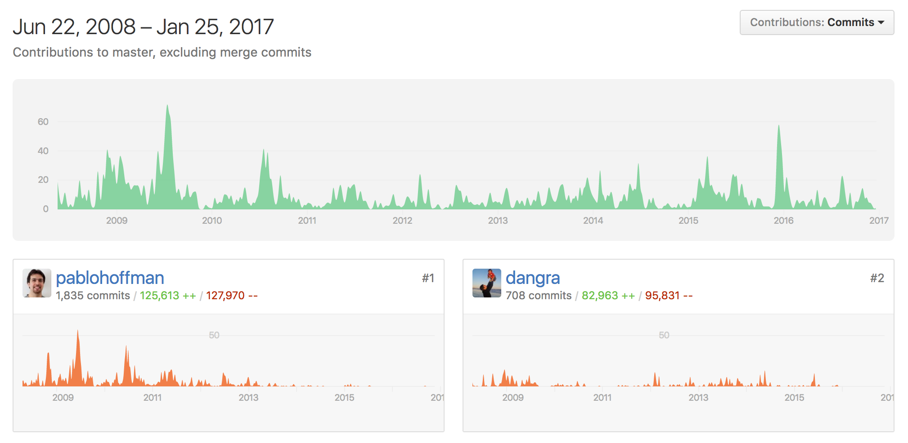

# Scrapy

把網站裝進爬蟲裡，總共分幾步？
答案很簡單，四步：

* 新建項目 (Project)：新建一個新的爬蟲項目
* 明確目標（Items）：明確你想要抓取的目標
* 製作爬蟲（Spider）：製作爬蟲開始爬取網頁
* 存儲內容（Pipeline）：設計管道存儲爬取內容

----

* crapy.cfg：工程的配置文件 
* scrapy_test：工程的Python文件目錄 
* scrapy_test/items.py：項目的items文件, 我們需要在此文件中定義需要從網頁中獲取的內容,對應上面說的步驟2 
* scrapy_test/pipelines.py：項目的pipelines文件, 用於保存處理爬取到的內容, 對應於步驟4 
* scrapy_test/settings.py：項目的設置文件 
* scrapy_test/spiders/：存儲爬蟲的目錄, 對應步驟3

----

通過urllib 獲取網頁的html 代碼，然後利用BeautifulSoup 或lxml 等xml parser解析出我們需要的內容。

[Python爬虫框架Scrapy实战之定向批量获取 -CSDN.NET](http://blog.csdn.net/HanTangSongMing/article/details/24454453)

----

用scrapy.spider.BaseSpider創建一個子類，並確定三個強制的屬性：

* name：爬蟲的識別名稱，必須是唯一的，在不同的爬蟲中你必須定義不同的名字。
* start_urls：爬取的URL列表。爬蟲從這裡開始抓取數據，所以，第一次下載的數據將會從這些urls開始。其他子URL將會從這些起始URL中繼承性生成。
* parse()：解析的方法，調用的時候傳入從每一個URL傳回的Response對象作為唯一參數，負責解析並匹配抓取的數據(解析為item)，跟蹤更多的URL。

**延伸閱讀**

* [Python Scrapy Tutorials](https://www.youtube.com/watch?v=758KrjCgkN8&list=PLiSJ-0KobHCKnku5ZuypaSwoTYjOJLjWL)
* [網路爬蟲實戰教學](https://www.youtube.com/playlist?list=PLohb4k71XnPaQRTvKW4Uii1oq-JPGpwWF)
* [Python网络爬虫实战 Scrapy](https://www.youtube.com/watch?v=JAGui0T91Fw&list=PLO5e_-yXpYLBO6ZaDgV7YH4drssQCSw5n)