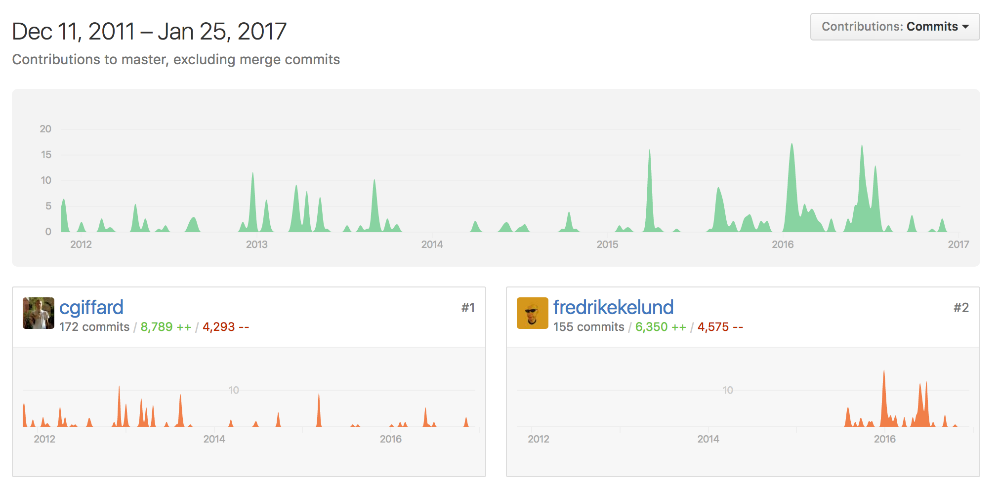

# Simple Crawler

> Very straightforward, event driven web crawler. Features a flexible queue interface and a basic cache mechanism with extensible backend.

### 特色

* 提供一個非常簡單的事件導向 API
* 以配置為基礎寫專屬於自己的爬蟲
* 自動遵守 robots.txt 訂定的規則
* 可彈性的控制 queue
* 提供最基本的網路效能統計資訊
* 抓取資料時有緩衝機制(buffers)，但不包含探索 links 的時候。
* 12,454 downloads in the last month

### 相依的模組

* [iconv-lite](https://github.com/ashtuchkin/iconv-lite)：處理編碼的問題
* [robots-parser](https://github.com/samclarke/robots-parser)：分析 robots.txt
* [urijs](https://github.com/medialize/URI.js)：working with URLs

<!--

### 下載條件

### 佇列 (queue)

### Cookies

### Link Discovery

### 錯誤排解 (FAQ / Troubleshooting)

-->